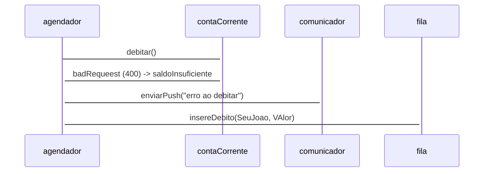

```mermaid
sequenceDiagram
    participant agendador
    participant contaCorrente
    participant comunicador
    participant fila
    agendador->+contaCorrente: debitar()
    contaCorrente->+agendador: badRequeest (400) -> saldoInsuficiente
    agendador->+comunicador: enviarPush("erro ao debitar")
    agendador->+fila: insereDebito(SeuJoao, VAlor)
```